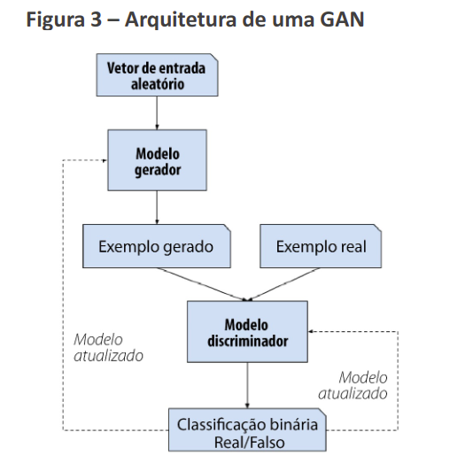

# Modelos Generativos Adversarias

* Gerador(Generator):

Vetor de entrada  -> Modelo gerador  ->  Exemplo gerado

* Discriminador (Discriminator):

Exemplo de entrada  ->  Modelo discriminador  ->  Classificação binária (real / fake )

### Tipos de GANS

* GAN Padrão: Vanilla GAN

* DCGAN (Deep Convolutional GAN):

Introduz camadas convolucionais no gerador e no discriminador , tornando-os especialmente eficazes na geração de imagens.

* CGAN (Condicional GAN):

Permite que o gerador e o dicriminador recebam informações condicionais;
Por exemplo, é possivel gerar imagens condicionadas a un rótulo específico, como "cães" e "gatos".

